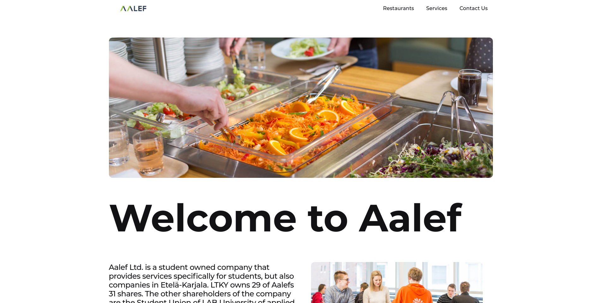
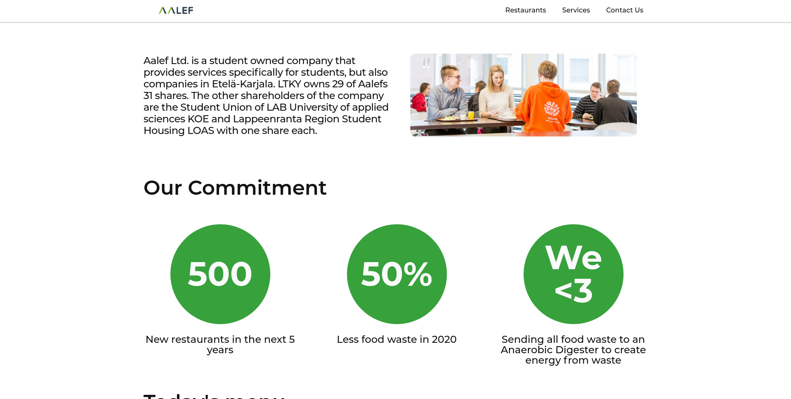
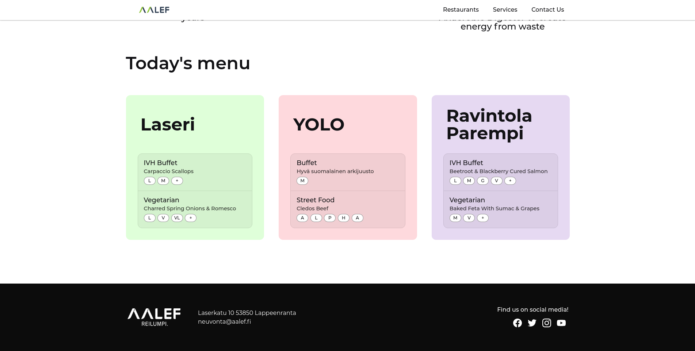

# Software Development Skills: Front-End 2020-21

Live page: [https://ce2kettu.github.io/front-end-course/](https://ce2kettu.github.io/front-end-course/)

Demo video: [https://streamable.com/xlm7dy](https://streamable.com/xlm7dy)

## Screenshots

## Introduction and motivation

### Motivation
At the time of writing it has been more than 3 years since the last time I have done any sort of front-end web development. And not soon after having started the project, I began to slowly recall why I enjoy doing this type of work. I feel like it's just so fulfilling being able to express yourself on a blank canvas. Though I must say that I, to this point, cannot draw for shit, but I feel like this is a great complement if anything.
The project idea was actually already in place before starting this course. So, being able to create and design my own project together with a course that merits study credits was a welcomed addition. :)
Also, this project really freshened up my memory about web development and the whole process of spending 5 hours to find the best color for an element...

### Introduction
The scope of the project was to create a new look and feel to the Aalef website we know and love (?). You can check out the website [here](https://aalef.fi/) if you are not familiar with it. Aalef Ltd. provides e.g., lunch and bookstore services for students on the LUT-University campus. I felt discouraged by not using any frameworks (like bro do I really want to copy paste my footer on every page?) and hence did not put my best effort into the project. (and I also didn't have the time)

## Installation and development

#### Setup
`git clone https://github.com/ce2kettu/front-end-course.git`

— and well that's kind of it. Just open the `course-project/dist/index.html` file in your preferred browser and you're good to go.

#### Watch sass
`npm run sass`

I also recommend using something like nodemon to refresh the page every time a change is made to HTML files.

#### Deploy to gh-pages
`npm run deploy`

## Remarks
- Use native web components or a framework even if you are doing a small interface mockup.
- Write CSS mobile first and not the other way around.
- CSS grid seems to be the de facto tool in front-end web development nowadays. As back when I was still active in this field, it did not have strong browser support.
- I usually design things as I go, and that does not usually end very well.
- I find that the exercise tutorial videos provided a wrong take on creating CSS media queries in Sass. I think they should be included within the initial block and not in a separate file. This makes things 10x easier.
- Write shared styles. E.g., header styles h1, h2, h3 and page layout setup. Makes it easy to keep styles consistent and make the site responsive.
